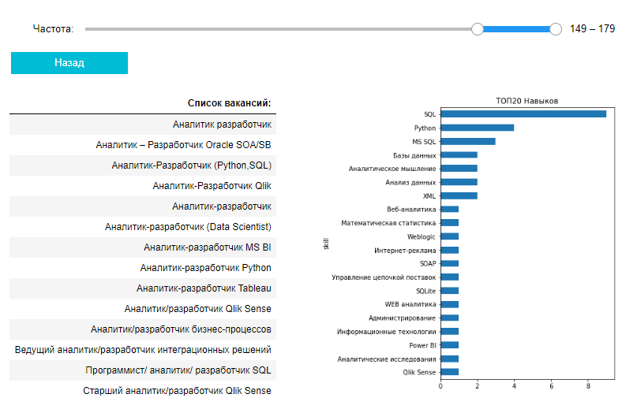

# parse_hhru
Это простой парсер вакансий, который работает с API hh.ru 
Он достаёт вакансии с сайтов, а потом и информацию из самих вакансий. 
### Последовательность запуска программ. ###
1. parse_search.py
2. get_tokens.py
3. table_all.py
4. build_report.ipunb
### База данных. ###
Стоит обратить внимание на то, что здесь используется PostgreSQL. 
Вы можете использовать любую другую БД, но для этого измените код. 
База данных должна иметь следующую структуру:  
>/Tables 
>>/skills 
>>>/vacancy 
>>>/skill 
>
>>/vacancies 
>>>/id 
>>>/name 
>>>/description 
>
### Зависимости. ###
Все модули указаны в файле requirements.txt
 
Но их слишком много, по факту понадобится только:
- requests
- sqlalchemy
- pandas
- scikit-learn
- IPython
- matloptlib
- ipywidgets
### Результат ###
<b>Навыки аналитиков</b>
 

 
<b>Облако по вакансиям "Программист"</b>
 

# Вот такие пирожки с котятами! #
